## Part 1

### Task 1

- Использовать Docker Swarm из первого проекта.
  - 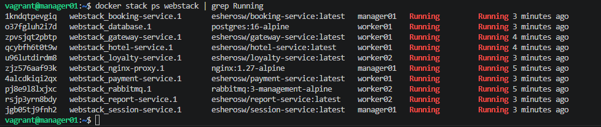

### Task 2

- Написать при помощи библиотеки Micrometer сборщики следующих метрик приложения:
  - количество отправленных сообщений в rabbitmq;
  - количество обработанных сообщений в rabbitmq;
  - количество бронирований;
  - количество полученных запросов на gateway;
  - количество полученных запросов на авторизацию пользователей.
    - Для сервисов booking-service, gateway-service, report-service, session-service:
    - pom.xml:
    - 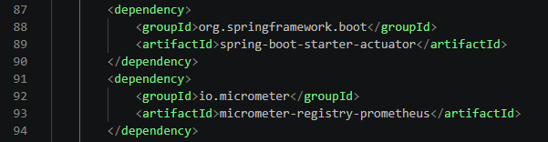
    - application.properties:
    - 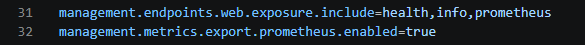

### Task 3

- Добавить логи приложения с помощью Loki.
  - src/monitoring/loki-config.yml:
  - 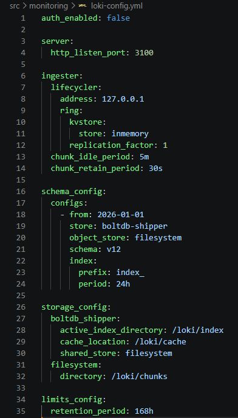
  - src/monitoring/promtail-config.yml:
  - 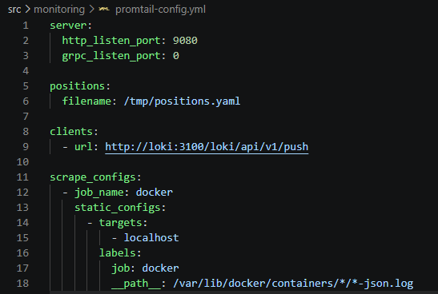

### Task 4

- Создать новый стек для Docker Swarm из сервисов с Prometheus Server, Loki, node_exporter, blackbox_exporter, cAdvisor. Проверить получение метрик на порту 9090 через браузер.
  - src/monitoring/prometheus.yml:
  - 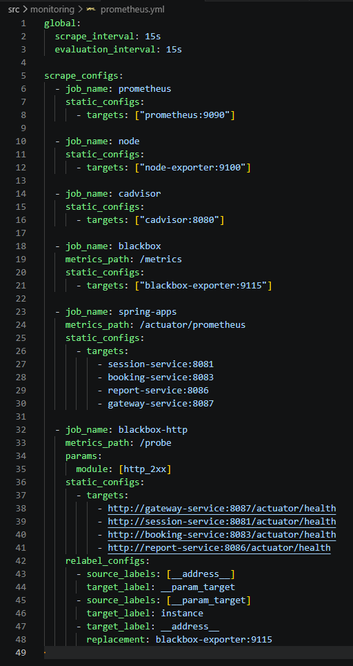
  - src/monitoring/loki-config.yml:
  - 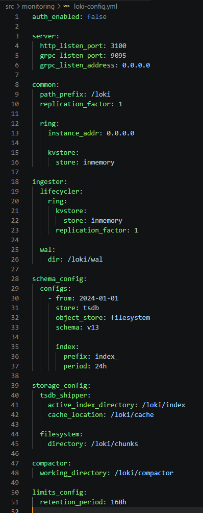
  - src/monitoring/blackbox.yml:
  - 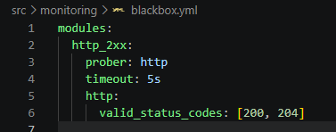
  - src/monitoring/stack.yml:
  - 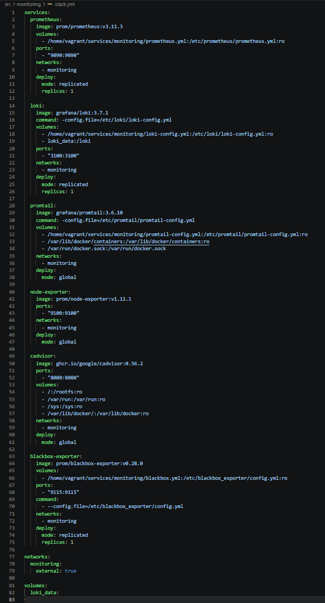

  - Prometheus `http://192.168.56.10:9090`:
  - 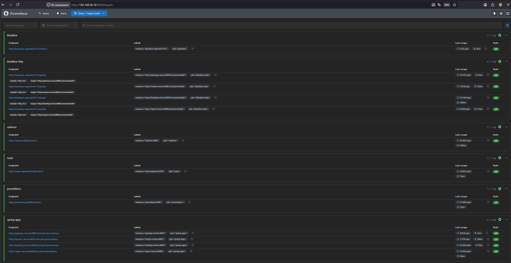
  - Prometheus проверка метрик:
  - 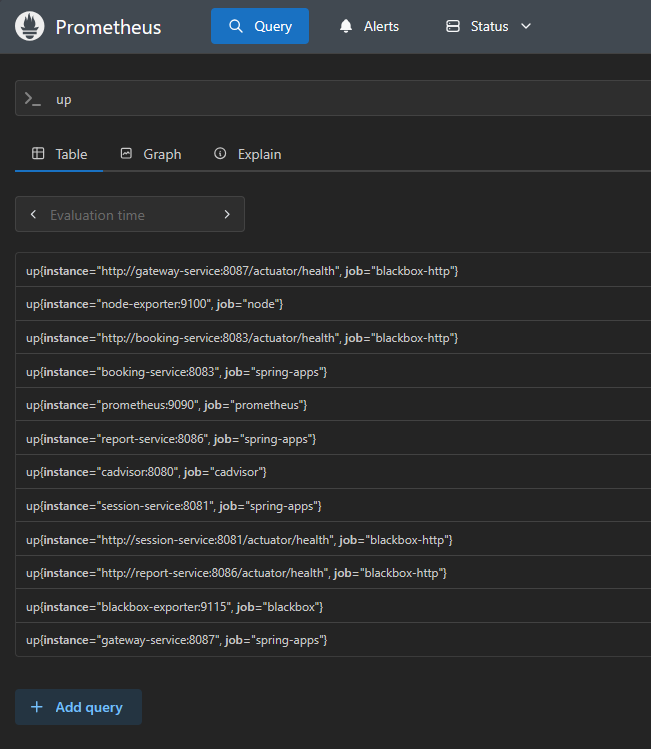
  - 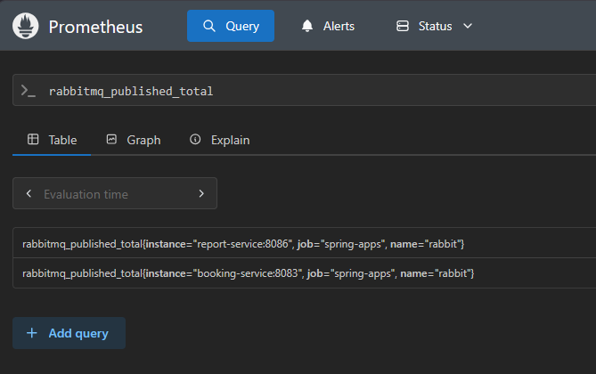
  - 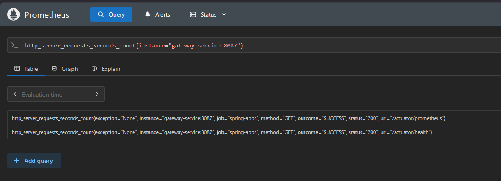

## Part 2

### Task 1

- Развернуть grafana как новый сервис в стеке мониторинга.
  - 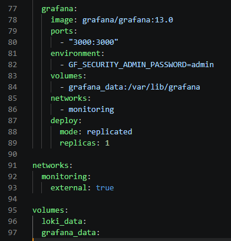

### Task 2

- Добавить в Grafana дашборд со следующими метриками:
  - количество нод;
  - количество контейнеров;
  - количество стеков;
  - использование CPU по сервисам;
  - использование CPU по ядрам и узлам;
  - затраченная RAM;
  - доступная и занятая память;
  - количество CPU;
  - доступность google.com;
  - количество отправленных сообщений в rabbitmq;
  - количество обработанных сообщений в rabbitmq;
  - количество бронирований;
  - количество полученных запросов на gateway;
  - количество полученных запросов на авторизацию пользователей;
  - логи приложения.
    - 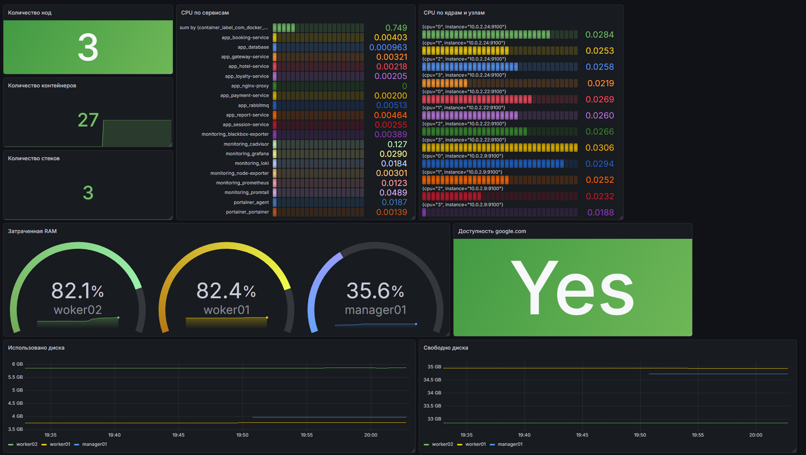
    - 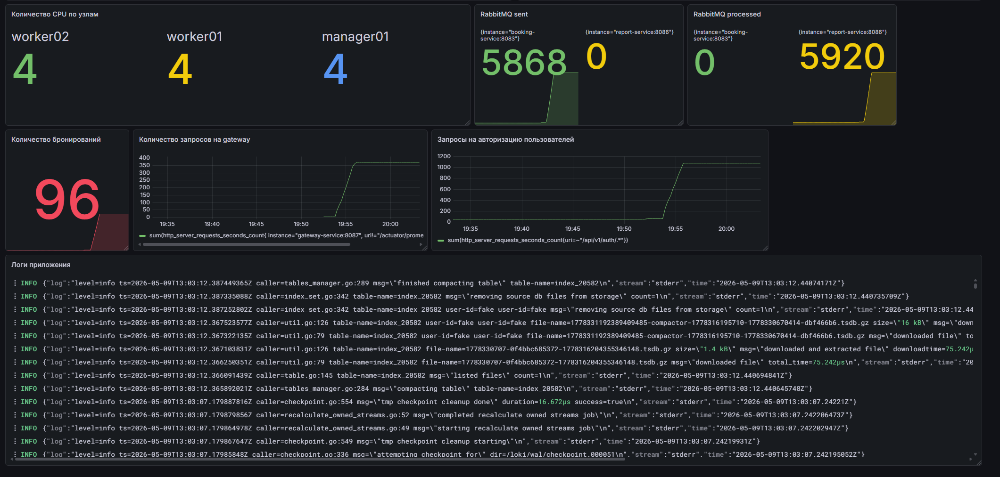

## Part 3

### Task 1

- Развернуть Alert Manager как новый сервис в стеке монтиторинга.
  - 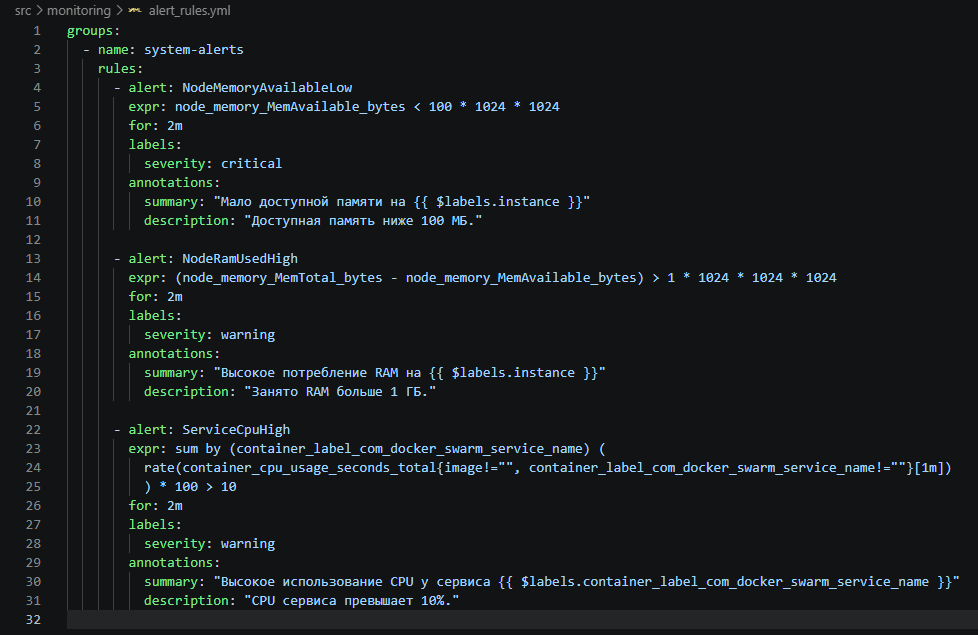
  - 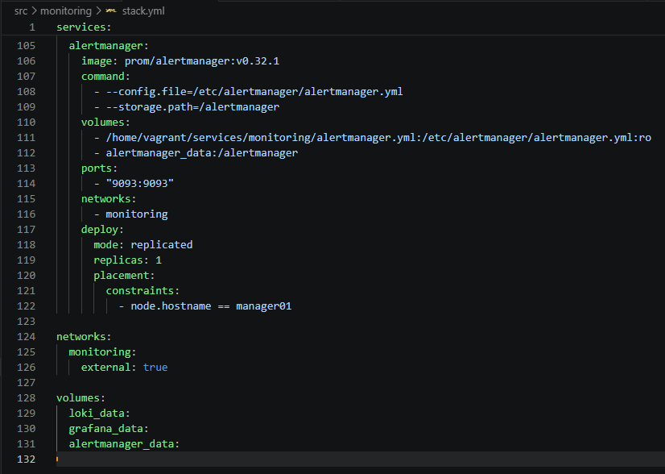

### Task 2

- Добавить следующие критические события:
  - доступная память меньше 100 Мб;
  - затраченная RAM больше 1 Гб;
  - использование CPU по сервису превышает 10%.
    - 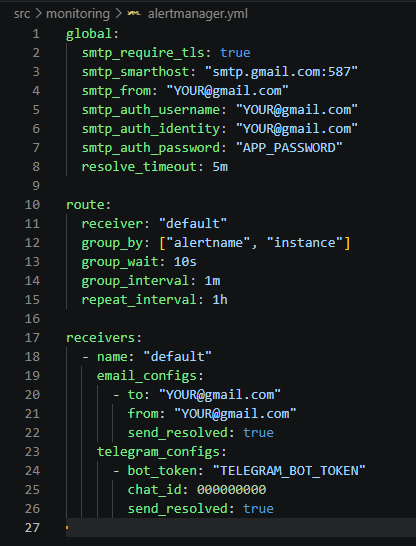

### Task 3

- Настроить получение оповещений через личные email и Телеграм.
  - 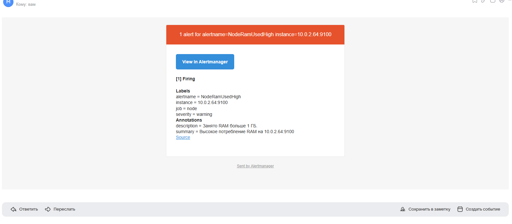
  - 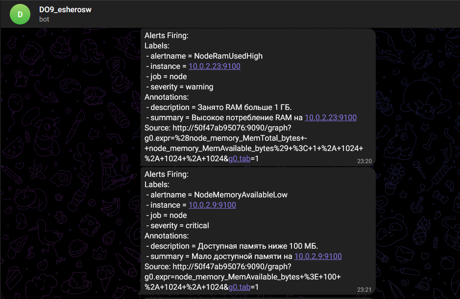
